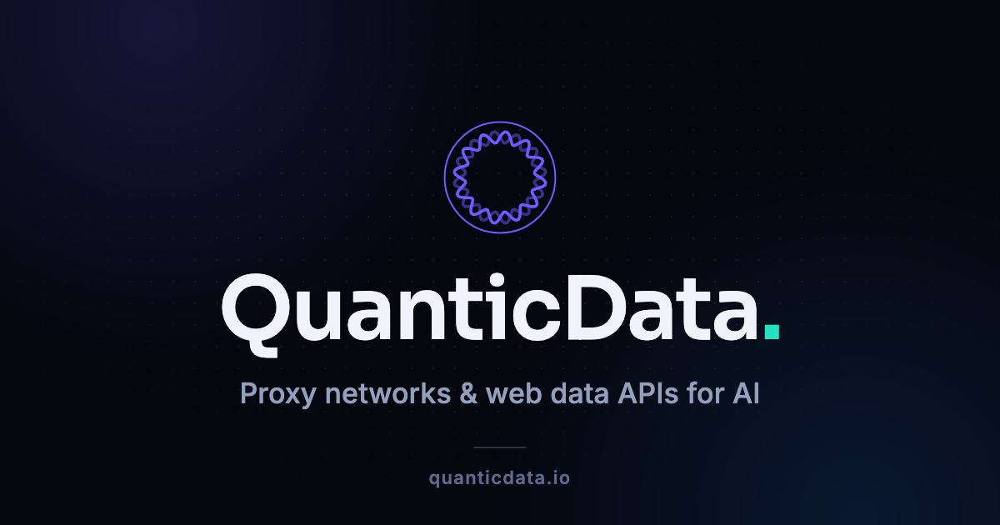

<p align="center">
  
</p>

<p align="center">
  <a href="https://quanticdata.io/docs/"><b>Documentation</b></a> ·
  <a href="https://quanticdata.io/collectors/">Collectors</a> ·
  <a href="https://quanticdata.io/mcp-server/">MCP server</a> ·
  <a href="https://quanticdata.io/blog/">Blog</a> ·
  <a href="https://app.quanticdata.io/register">Free API key</a>
</p>

---

# QuanticData

Web data infrastructure: **six REST endpoints**, **31 ready-made scrapers**, an **MCP server**
for AI agents, and **six proxy networks** underneath all of it. One Bearer key, one JSON
envelope, and you are only billed for calls that succeed.

This repository is the index. Every example linked below is a real, runnable repo.

## Contents

- [Quick start](#quick-start)
- [The Data APIs](#the-data-apis)
- [Collectors](#collectors)
- [Proxy networks](#proxy-networks)
- [For AI agents](#for-ai-agents)
- [Examples by use case](#examples-by-use-case)
- [Examples by language](#examples-by-language)
- [Pricing model](#pricing-model)

## Quick start

```bash
export QD_API_KEY=qd_live_your_key_here

curl https://api.quanticdata.io/v1/scrape \
  -H "Authorization: Bearer $QD_API_KEY" \
  -H "Content-Type: application/json" \
  -d '{"url": "https://example.com", "format": "markdown"}'
```

```jsonc
{ "type": "response",
  "message": "Scrape complete",
  "payload": {
    "url": "https://example.com",
    "markdown": "# Example Domain\n…",
    "metadata": { "title": "Example Domain", "canonical": "https://example.com/" },
    "usage": { "cost_usd": 0.0002 } } }
```

Same envelope on every endpoint: `type`, `message`, `payload`. Failures answer
`{"type": "error", "message": "…"}` and cost nothing.

Eight languages, side by side:
**[quanticdata-api-quickstart](https://github.com/quantumproxies/quanticdata-api-quickstart)**

## The Data APIs

| Endpoint | What it does | Price | Examples |
|---|---|---|---|
| `POST /v1/scrape` | one page → Markdown, HTML, text, CSS or AI extraction, screenshots | $0.0002 | [web-scraping-api-examples](https://github.com/quantumproxies/web-scraping-api-examples) |
| `POST /v1/serp` | 4 engines, 18 verticals, parsed to JSON | from $0.0005 | [serp-api-python-client](https://github.com/quantumproxies/serp-api-python-client) |
| `POST /v1/map` | every URL of a site, sitemaps + links, flat price | $0.0005 | [crawl-and-map-api-examples](https://github.com/quantumproxies/crawl-and-map-api-examples) |
| `POST /v1/crawl` | async BFS crawl → Markdown per page | $0.0003/page | [crawl-and-map-api-examples](https://github.com/quantumproxies/crawl-and-map-api-examples) |
| `POST /v1/batch` | up to 1,000 known URLs, one job id | $0.0002/URL | [batch-url-scraping-jobs](https://github.com/quantumproxies/batch-url-scraping-jobs) |
| `POST /v1/seo-audit` | no-JS view vs rendered view, diffed | $0.0012 | [seo-audit-api-examples](https://github.com/quantumproxies/seo-audit-api-examples) |

Full reference: [quanticdata.io/docs](https://quanticdata.io/docs/)

## Collectors

Thirty-one versioned scrapers you call with a **semantic input** — a keyword and a city, an ASIN,
a domain, a handle — instead of a URL and a set of selectors. Published input and output schemas,
an hourly health probe, and a price per **delivered row**.

Start here: **[collectors-api-examples](https://github.com/quantumproxies/collectors-api-examples)**
· catalogue at [quanticdata.io/collectors](https://quanticdata.io/collectors/)

| Area | Collectors | Examples |
|---|---|---|
| Search & SEO | `web_search` `search_images` `search_videos` `keyword_ideas` | [keyword-research-api-examples](https://github.com/quantumproxies/keyword-research-api-examples) |
| Local | `google_maps_places` `place_reviews` | [google-maps-places-api-examples](https://github.com/quantumproxies/google-maps-places-api-examples) · [google-reviews-api-examples](https://github.com/quantumproxies/google-reviews-api-examples) |
| E-commerce | `amazon_search` `amazon_product` `ebay_search` `aliexpress_search` `google_shopping` `product_offers` | [amazon-product-api-examples](https://github.com/quantumproxies/amazon-product-api-examples) · [competitor-price-monitoring-api](https://github.com/quantumproxies/competitor-price-monitoring-api) |
| Jobs | `linkedin_jobs` `indeed_jobs` `google_jobs` | [linkedin-jobs-api-examples](https://github.com/quantumproxies/linkedin-jobs-api-examples) · [indeed-jobs-api-python](https://github.com/quantumproxies/indeed-jobs-api-python) |
| Social & video | `youtube_search` `youtube_channel` `instagram_profile` `tiktok_profile` `tiktok_video` `reddit_posts` | [youtube-scraper-api-examples](https://github.com/quantumproxies/youtube-scraper-api-examples) · [instagram-tiktok-profile-api](https://github.com/quantumproxies/instagram-tiktok-profile-api) |
| Companies & leads | `company_profile` `site_contacts` `local_business_leads` `linkedin_company` `linkedin_profile` | [lead-scraper-api-examples](https://github.com/quantumproxies/lead-scraper-api-examples) · [company-data-enrichment](https://github.com/quantumproxies/company-data-enrichment) |
| Apps | `app_store_apps` `google_play_apps` | [app-store-data-examples](https://github.com/quantumproxies/app-store-data-examples) |
| Real estate | `zillow_search` | [zillow-listings-api-examples](https://github.com/quantumproxies/zillow-listings-api-examples) |
| News | `google_news` | [reddit-news-monitoring](https://github.com/quantumproxies/reddit-news-monitoring) |
| Travel | `hotels` | [hotels-and-travel-data-api](https://github.com/quantumproxies/hotels-and-travel-data-api) |

## Proxy networks

| Network | Gateway | Page |
|---|---|---|
| Residential Premium | `pr.quanticdata.io:7777` | [residential-proxies](https://quanticdata.io/residential-proxies/) |
| Residential / rotating | `resi.quanticdata.io:8080` · `rotate.quanticdata.io:8000` | [cheap-residential-proxies](https://quanticdata.io/cheap-residential-proxies/) · [rotating-proxies](https://quanticdata.io/rotating-proxies/) |
| SOCKS5 | `resi.quanticdata.io:1080` | [socks5-proxies](https://quanticdata.io/socks5-proxies/) |
| Mobile | `mb.quanticdata.io:7777` | [mobile-proxies](https://quanticdata.io/mobile-proxies/) |
| Datacenter | `dc.quanticdata.io:7777` | [datacenter-proxies](https://quanticdata.io/datacenter-proxies/) |
| ISP | `isp.quanticdata.io:8000` | [isp-proxies](https://quanticdata.io/isp-proxies/) |
| IPv6 | `v6.quanticdata.io:7777` | [ipv6-proxies](https://quanticdata.io/ipv6-proxies/) |

Targeting is expressed in the username — `USER-country-de-city-berlin-session-a91f-sessTime-30`.
Full syntax and eight-language examples:
**[quanticdata-proxy-quickstart](https://github.com/quantumproxies/quanticdata-proxy-quickstart)**

Also: [mobile-proxy-examples](https://github.com/quantumproxies/mobile-proxy-examples) ·
[ipv6-proxy-examples](https://github.com/quantumproxies/ipv6-proxy-examples) ·
[sneaker-proxy-setup](https://github.com/quantumproxies/sneaker-proxy-setup)

## For AI agents

Everything above is exposed as MCP tools, so an agent can search, read, map, crawl and run
collectors on its own.

- **[quanticdata-mcp-server](https://github.com/quantumproxies/quanticdata-mcp-server)** — a
  single-file, zero-dependency MCP server for Claude Code, Claude Desktop, Cursor and anything
  else that speaks the protocol
- **[web-data-for-ai-agents](https://github.com/quantumproxies/web-data-for-ai-agents)** — the
  same tools wired into Anthropic and OpenAI tool-calling loops
- **[rag-corpus-builder](https://github.com/quantumproxies/rag-corpus-builder)** — sites →
  chunked, de-duplicated, cited JSONL
- **[ai-extraction-examples](https://github.com/quantumproxies/ai-extraction-examples)** —
  CSS selectors vs LLM extraction, and the hybrid that survives a redesign
- **[browser-ai-agent-examples](https://github.com/quantumproxies/browser-ai-agent-examples)** —
  a goal-driven agent loop on the live APIs

Product pages: [Web Data API for AI](https://quanticdata.io/web-data-api-for-ai/) ·
[MCP server](https://quanticdata.io/mcp-server/) ·
[AI web scraping](https://quanticdata.io/ai-web-scraping-service/) ·
[Browser AI](https://quanticdata.io/browser-ai/)

## Examples by use case

| I want to… | Repo |
|---|---|
| watch competitor prices | [competitor-price-monitoring-api](https://github.com/quantumproxies/competitor-price-monitoring-api) |
| build a lead list with contacts | [lead-scraper-api-examples](https://github.com/quantumproxies/lead-scraper-api-examples) |
| enrich a list of domains | [company-data-enrichment](https://github.com/quantumproxies/company-data-enrichment) |
| size a market from live data | [market-research-datasets](https://github.com/quantumproxies/market-research-datasets) |
| track brand mentions | [reddit-news-monitoring](https://github.com/quantumproxies/reddit-news-monitoring) |
| plan content from real demand | [keyword-research-api-examples](https://github.com/quantumproxies/keyword-research-api-examples) |
| check a site is indexable without JS | [seo-audit-api-examples](https://github.com/quantumproxies/seo-audit-api-examples) |
| feed a RAG index | [rag-corpus-builder](https://github.com/quantumproxies/rag-corpus-builder) |
| scrape thousands of known URLs | [batch-url-scraping-jobs](https://github.com/quantumproxies/batch-url-scraping-jobs) |
| map a site before crawling it | [crawl-and-map-api-examples](https://github.com/quantumproxies/crawl-and-map-api-examples) |
| pull property listings | [zillow-listings-api-examples](https://github.com/quantumproxies/zillow-listings-api-examples) |
| compare hotel rates by market | [hotels-and-travel-data-api](https://github.com/quantumproxies/hotels-and-travel-data-api) |

Use-case pages: [company data](https://quanticdata.io/scrape-company-data/) ·
[price monitoring](https://quanticdata.io/competitor-price-monitoring/) ·
[market research](https://quanticdata.io/market-research-data/) ·
[real estate](https://quanticdata.io/real-estate-data-scraping/) ·
[job postings](https://quanticdata.io/scrape-job-postings/)

## Examples by language

| Language | Where |
|---|---|
| Python | most repos — start with [quanticdata-api-quickstart](https://github.com/quantumproxies/quanticdata-api-quickstart) |
| Node.js | [amazon-product-api-examples](https://github.com/quantumproxies/amazon-product-api-examples) · [youtube-scraper-api-examples](https://github.com/quantumproxies/youtube-scraper-api-examples) · [quanticdata-mcp-server](https://github.com/quantumproxies/quanticdata-mcp-server) |
| Go, PHP, Ruby, Java, C#, shell | [quanticdata-api-quickstart](https://github.com/quantumproxies/quanticdata-api-quickstart) · [quanticdata-proxy-quickstart](https://github.com/quantumproxies/quanticdata-proxy-quickstart) |

## Pricing model

**Pay per success.** A call that fails costs nothing. Async jobs are charged on requested volume
and auto-refund the unfetched share when they settle. Collectors bill per delivered row, so a run
that returns nothing returns a bill of nothing.

Unit prices and the free monthly allowance: [quanticdata.io/docs](https://quanticdata.io/docs/)

## Free tools

[curl converter](https://quanticdata.io/tools/curl-converter/) ·
[robots.txt tester](https://quanticdata.io/tools/robots-txt-tester/) ·
[robots.txt generator](https://quanticdata.io/tools/robots-txt-generator/) ·
[user-agent lookup](https://quanticdata.io/tools/user-agent/)

## Reading

[What is a web scraper API?](https://quanticdata.io/blog/what-is-a-web-scraper-api/) ·
[How a SERP API works](https://quanticdata.io/blog/how-a-serp-api-works/) ·
[How MCP servers work](https://quanticdata.io/blog/how-mcp-servers-work/) ·
[What is web data?](https://quanticdata.io/blog/what-is-web-data/) ·
[Is web scraping legal in the US?](https://quanticdata.io/blog/is-web-scraping-legal-in-us/) ·
[…the whole blog](https://quanticdata.io/blog/)

---

Every example repository is MIT licensed. Questions: **hello@quanticdata.io** ·
[quanticdata.io](https://quanticdata.io) · [Partners](https://quanticdata.io/partners/)
